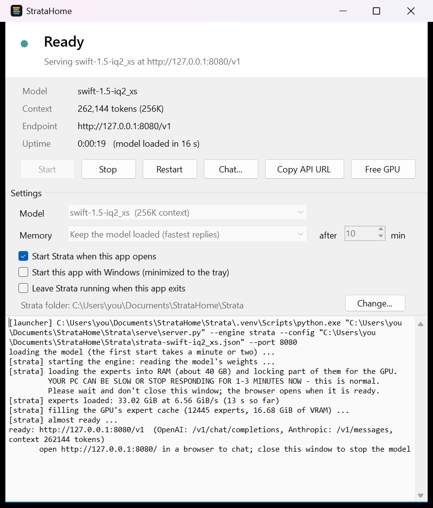

# StrataHome

**An unofficial tray launcher for [Strata](https://github.com/Niko1221/Strata).** It starts Strata's local model server without a console window, without a browser tab and without batch files, and gives you a native chat window so nothing else has to be open.



- **Download:** [StrataHome.exe](https://github.com/majieddd/stratahome/releases/latest/download/StrataHome.exe) (about 80 KB, Windows 10/11)
- **Page:** https://majieddd.github.io/stratahome/
- **Not affiliated with Strata or its author.** Strata is MIT-licensed; the models it runs have their own licences.

## What it does

| | |
|---|---|
| **Starts the server directly** | Runs Strata's `serve\server.py` with its own Python, hidden. No `cmd` window, no `START-HERE.bat`, and no `--open`, so no browser tab. |
| **Lives in the tray** | The icon shows the state: Stopped, Starting, Loading the model, Ready, Idle (model unloaded), Problem. A notification appears when the model is ready. |
| **Native chat window** | Streaming answers, a choice of thinking level (none / low / medium / high) and a tokens-per-second readout. Plain text: Markdown is shown as written. |
| **Memory modes** | Keep the model loaded; unload when idle after N minutes (frees GPU and RAM, and the next request reloads it); or load on first request. **Free GPU** / **Load now** buttons. |
| **Never leaves a 36 GB server behind** | The server runs inside a Windows job object, so closing or crashing the app stops it. Tick *Leave Strata running when this app exits* to opt out. |
| **Attaches to a running server** | If Strata was started some other way (for example `START-HERE.bat`), StrataHome attaches to it, shows its state and can stop it. |
| **Copy API URL** | Puts `http://127.0.0.1:8080/v1` (OpenAI-compatible) on the clipboard. |
| **Start with Windows** | Optional, off by default. Starts minimized to the tray. |

It makes **no network connections except to localhost** and sends no telemetry.

## Install

1. Install Strata once with its own `START-HERE.bat` (StrataHome does not download Strata or any model).
2. Download `StrataHome.exe` from the [latest release](https://github.com/majieddd/stratahome/releases/latest) and put it anywhere.
3. Run it. It looks for Strata in the usual places; if it cannot find it, click **Change...** and pick the folder that contains `serve\server.py`.

**Windows SmartScreen** may say *Windows protected your PC* because the exe is not code-signed. Choose *More info*, then *Run anyway*, or verify the file against the SHA-256 in the release notes, or build it yourself (below).

Requirements: Windows 10 (1903 or newer) or Windows 11, 64-bit, plus whatever Strata itself needs (an NVIDIA or AMD card with 12 GB or more of VRAM and 32 GB or more of RAM).

## Build it yourself

No SDK and no installs: the C# compiler that ships with Windows is enough.

```
build.cmd
```

This writes `dist\StrataHome.exe`. The sources are in `src\`.

## Check that it works

```
StrataHome.exe --selftest
```

runs 14 automated lifecycle checks against Strata's built-in mock engine (no model, no GPU, port 18095) and writes the result to `%LOCALAPPDATA%\StrataHome\logs\selftest.txt`. It covers start, stop, "no browser flag", "no window", clean-up when the app exits, `KeepRunning`, attaching to a running server, a busy port, crash detection and restart. Exit code 0 means everything passed.

Other flags: `--minimized` (start in the tray), `--no-start` (do not start Strata on launch), `--mode always|idle|ondemand` and `--idle-minutes N` (pick the memory mode for this launch; they are saved like any change made in the window), `--probe` (write what it found to `logs\probe.txt`), `--screenshot <png>` and `--screenshot-chat <png>` (save the real windows; used for the images on this page, with your home folder replaced by `C:\Users\you`).

## Where things are stored

| What | Where |
|---|---|
| Settings | `%APPDATA%\StrataHome\settings.json` |
| Logs (last five runs, plus `app.log`) | `%LOCALAPPDATA%\StrataHome\logs\` |
| Start with Windows | `HKCU\Software\Microsoft\Windows\CurrentVersion\Run`, value `StrataHome` (only if you tick the box) |

## Known limits

- Windows only, and it needs a working Strata install first.
- The chat window shows plain text; Markdown is not rendered.
- The window is scaled once at start from the display's DPI. Moving it to a monitor with a different scale makes Windows stretch it.
- Not code-signed.

## Licence

MIT, see [LICENSE](LICENSE). Strata is by Niko1221 and MIT-licensed; its models and components carry their own licences.
