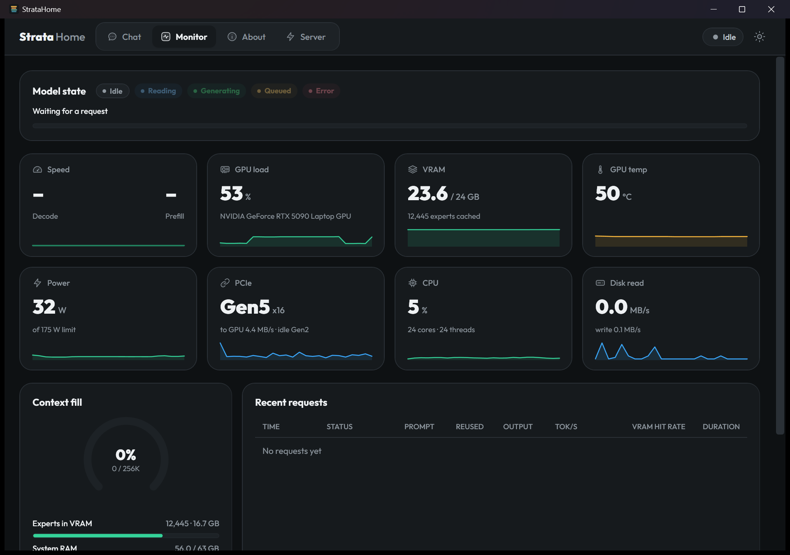
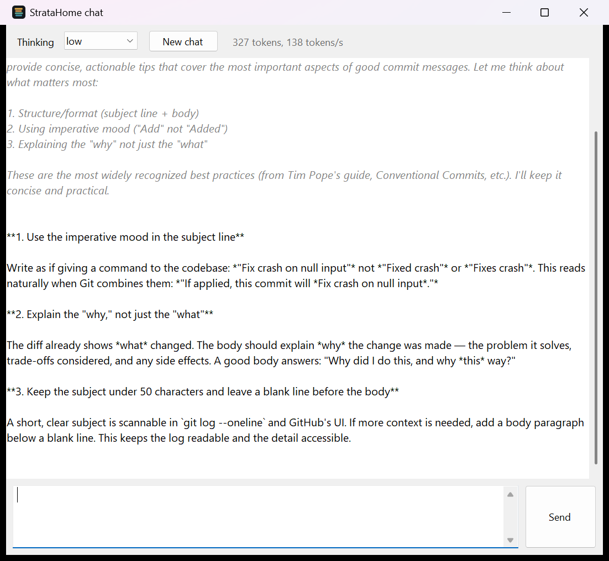
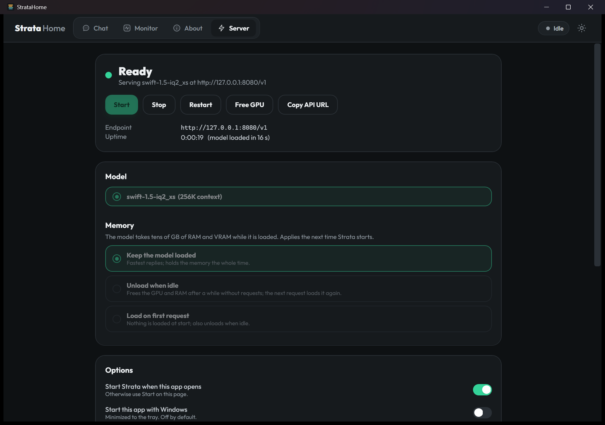

# StrataHome

**An unofficial desktop app for [Strata](https://github.com/Niko1221/Strata).** It starts Strata's local model server without a console window and without a browser tab, and gives you a native window that looks and works like Strata's own web app: Chat, a live Monitor with all the meters, an About page, and the server controls. You do not need a browser for anything.



- **Download:** [StrataHome.exe](https://github.com/majieddd/stratahome/releases/latest/download/StrataHome.exe) (about 370 KB, Windows 10/11)
- **Page:** https://majieddd.github.io/stratahome/
- **Not affiliated with Strata or its author.** Strata is MIT-licensed; the models it runs have their own licences.

## What is in the window

| Tab | What it does |
|---|---|
| **Chat** | Streaming answers with Markdown (headings, lists, tables, code blocks with a copy button), a collapsible "Thought for 1.2 s" block for the model's reasoning, tokens and tok/s under each answer, attach a text file (or drop one), New chat with Undo, save the chat as Markdown. The **Sampling** drawer sets thinking (none / low / medium / high), temperature, top-p, top-k, max tokens and seed, and can share them with other apps. The conversation is kept on this PC. |
| **Monitor** | The same live meters as the web app, refreshed every second: model state (idle, reading the prompt, generating, queued, error) with a progress bar, decode and prefill speed, GPU load, VRAM, GPU temperature, power, PCIe link and traffic, CPU, disk, context fill gauge, experts held in VRAM, system RAM, and a table of recent requests (prompt, reused, output, tok/s, VRAM hit rate, duration). |
| **About** | The loaded model and engine (context, KV cache, experts in VRAM, speculation), this PC's GPU / CPU / RAM, copy-ready OpenAI and Anthropic base URLs for your other tools, the API key field, dark / light theme, and the model's own run settings read from Strata's `/config` and saved back to it. |
| **Server** | Start, Stop, Restart, **Free GPU**, **Copy API URL**; the model list; the memory mode (keep the model loaded, unload when idle after N minutes, or load on the first request); and the options below. |

Light and dark themes, the Outfit font and the emerald accent are taken from Strata's web app. The window also keeps a **tray icon** that shows the state (Stopped, Starting, Loading, Ready, Idle, Problem); closing the window sends it to the tray.

|  |  |
|---|---|
|  |  |

## What else it does

| | |
|---|---|
| **Starts the server directly** | Runs Strata's `serve\server.py` with its own Python, hidden: no `cmd` window, no `START-HERE.bat`, and no `--open`, so no browser tab. |
| **Never leaves a 36 GB server behind** | The server runs inside a Windows job object, so closing or crashing the app stops it. Tick *Leave Strata running when this app exits* to opt out. |
| **Attaches to a running server** | If Strata was started some other way (for example `START-HERE.bat`), StrataHome attaches to it, shows its state and meters, and can stop it. |
| **Light on resources** | With the window open it uses about 150 MB of RAM. Closed to the tray it gives memory back to Windows (about 15 MB resident, measured) and asks the server for its state every 5 seconds instead of every second. |
| **Start with Windows** | Optional, off by default. Starts minimized to the tray. |

It makes **no network connections except to localhost** and sends no telemetry.

## Install

1. Install Strata once with its own `START-HERE.bat` (StrataHome does not download Strata or any model).
2. Download `StrataHome.exe` from the [latest release](https://github.com/majieddd/stratahome/releases/latest) and put it anywhere.
3. Run it. It looks for Strata in the usual places; if it cannot find it, open the **Server** tab, click **Change...** and pick the folder that contains `serve\server.py`.

**Windows SmartScreen** may say *Windows protected your PC* because the exe is not code-signed. Choose *More info*, then *Run anyway*, or verify the file against the SHA-256 in the release notes, or build it yourself (below).

Requirements: Windows 10 (1903 or newer) or Windows 11, 64-bit, plus whatever Strata itself needs (an NVIDIA or AMD card with 12 GB or more of VRAM and 32 GB or more of RAM). It uses WPF, which ships with Windows, so there is nothing else to install.

## Build it yourself

No SDK and no installs: the C# compiler and the WPF libraries that ship with Windows are enough.

```
build.cmd
```

This writes `dist\StrataHome.exe` (`build.cmd dev` writes `dist\dev\StrataHome.exe`, so you can build while the real one is running). The sources are in `src\` (`src\Ui\` is the window). The Outfit font is embedded in the exe. `tools\make_ui_assets.py` regenerates the fonts and the icon paths from a Strata checkout; the exe does not need Python.

## Check that it works

```
StrataHome.exe --selftest
```

runs 14 automated lifecycle checks against Strata's built-in mock engine (no model, no GPU, port 18095) and writes the result to `%LOCALAPPDATA%\StrataHome\logs\selftest.txt`. It covers start, stop, "no browser flag", "no window", clean-up when the app exits, `KeepRunning`, attaching to a running server, a busy port, crash detection and restart. Exit code 0 means everything passed.

```
StrataHome.exe --instance test --uitest
```

drives the real window against a running Strata and writes `logs\uitest.txt`: 28 checks that click every tab and the theme button, open and close the Sampling drawer, render a sample of Markdown, feed the Monitor a full and an empty `/metrics`, send a chat message and stop another one mid-answer, attach a file the model has to read, and check the status pill. It uses your running server (or starts it) and removes the test conversation afterwards.

Other flags: `--minimized` (start in the tray), `--no-start` (do not start Strata on launch), `--mode always|idle|ondemand` and `--idle-minutes N` (memory mode for this launch; saved like any change made in the window), `--instance NAME` (run a second copy next to the real one), `--tab chat|monitor|about|server`, `--theme light|dark`, `--size WxH`, `--probe` (write what it found to `logs\probe.txt`), and for screenshots `--screenshot <png>` with `--delay SECONDS`, `--prompt "text"` (send one message first) and `--drawer`. Screenshots show the real window with your home folder replaced by `C:\Users\you`; they are what the images on this page are made from.

## Where things are stored

| What | Where |
|---|---|
| Settings (including the API key, if you set one) | `%APPDATA%\StrataHome\settings.json` |
| Chat | `%APPDATA%\StrataHome\chat.json` |
| Logs (last five runs, plus `app.log`) | `%LOCALAPPDATA%\StrataHome\logs\` |
| Font copies (WPF loads fonts from files) | `%LOCALAPPDATA%\StrataHome\fonts\` |
| Start with Windows | `HKCU\Software\Microsoft\Windows\CurrentVersion\Run`, value `StrataHome` (only if you tick the box) |

## Known limits

- Windows only, and it needs a working Strata install first.
- Chat is text only: you can attach text files, but not pictures, and there is no tool or MCP support. One conversation is kept at a time (New chat clears it; Undo brings it back for a few seconds).
- It is a re-creation of the web app's look and meters in WPF, not the web app itself, so changes to Strata's own page will not appear here until this app is updated. Strata's page stays available at the server address if you ever want it.
- The window is scaled once at start from the display's DPI. Moving it to a monitor with a different scale makes Windows stretch it.
- Not code-signed.

## Licence

MIT, see [LICENSE](LICENSE). The look of the window is ported from Strata's web app (MIT) and uses the Outfit font (SIL OFL 1.1); see [NOTICE.md](NOTICE.md). Strata is by Niko1221 and MIT-licensed; its models and components carry their own licences.
